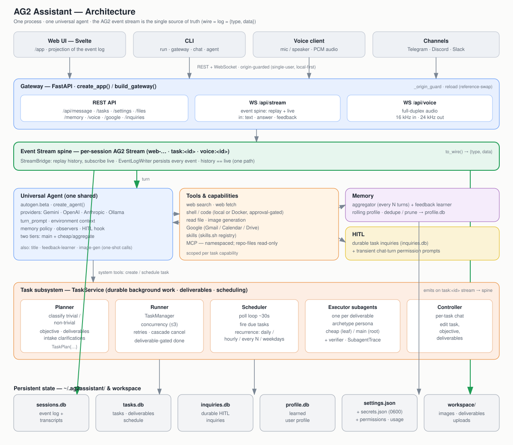

# AG2 Assistant

An open-source personal AI assistant powered by [AG2](https://ag2.ai)'s Beta framework, built in Python.

> Public product name: **AG2 Assistant**. `ag2-assistant` remains the internal package, CLI command, and data-dir name.

AG2 Assistant is a web app (with optional messaging-channel and CLI front-ends) that acts as your personal AI agent — it searches the web, runs code, generates images, reads your project files, and runs scheduled tasks, all while showing its work in the open. Every reply is a projection of the underlying AG2 event stream.

## Quick Start

### 1. Install

The quickest way — one line, no clone, no Python setup (the script installs [uv](https://docs.astral.sh/uv/) if needed, and uv brings its own Python):

```bash
curl -fsSL https://raw.githubusercontent.com/ag2ai/ag2-assistant/main/scripts/install.sh | sh
```

On Windows:

```powershell
powershell -ExecutionPolicy Bypass -c "irm https://raw.githubusercontent.com/ag2ai/ag2-assistant/main/scripts/install.ps1 | iex"
```

Re-run the same script any time to upgrade. Or clone for a development checkout:

```bash
git clone https://github.com/ag2ai/ag2-assistant.git
cd ag2-assistant
python -m venv .venv
source .venv/bin/activate
pip install -e ".[dev]"
```

The repo also ships a `uv.lock`, so `uv run ag2-assistant …` and `uv run pytest` work without setting up a venv yourself.

Or just install the CLI globally yourself, no clone (git = latest commit; releases publish to PyPI from the first tagged version):

```bash
uv tool install "git+https://github.com/ag2ai/ag2-assistant.git"   # or: pipx install "git+https://github.com/ag2ai/ag2-assistant.git"
```

Prefer to run it as an always-on container? See [Deployment](#deployment).

### 2. Run

```bash
ag2-assistant run        # gateway + web UI (+ any configured channels), one process
```

Then open **http://localhost:8800/** and follow the first-run setup — six short steps:

1. **Welcome** — your name.
2. **About you** — location, working hours, preferred answer style (all optional, shared by every profile).
3. **Connect** — add a provider key (Gemini is the default and recommended — get one at [aistudio.google.com](https://aistudio.google.com/apikey)), or **sign in with ChatGPT** to run on your existing ChatGPT subscription instead of an API key. You can't continue until one of the two works.
4. **Profiles** — create at least one profile (e.g. *Personal*), each a colour-coded, fully isolated workspace.
5. **Set up** — per profile: an optional read-only project folder and the kinds of work you want help with.
6. **Ready** — pick a theme and start.

Everything here is changeable later in **Settings**.

> Prefer to set the key up front? Put `GEMINI_API_KEY=your-key` in a `.env` (see `.env.example`) before running — keys can come from the environment, and setup will pick them up.

To serve the API/UI without any messaging channels, use `ag2-assistant gateway` instead of `run`.

## Profiles

The assistant is organised into **profiles** — separate, colour-coded workspaces you switch between from the sidebar (or ⌘1–⌘9). A profile has its own chats, tasks, memory, files, project folder, MCP servers and permissions, so a *Work* profile never sees your *Personal* one.

Provider keys, the model configuration, and who you are are shared install-wide (the global `~/.ag2assistant/config.yaml`); everything else is per profile, overlaid from that profile's `~/.ag2assistant/profiles/<id>/config.yaml`. State lives in `~/.ag2assistant/profiles/<id>/` and generated files in `~/Documents/AG2 Assistant/<Profile>/`. Override the install root with `--data-dir` (or `AG2ASSISTANT_DATA_DIR`).

## The web app

The primary interface is the Svelte web UI served at `/` (→ `/app`). It includes:

- **Chat** — multi-turn conversations with live, streamed agent events (tool calls, code runs, web searches) rendered inline. Attach images or documents and ask about them.
- **Rich answers** — where structure beats prose, the agent renders a live surface instead: a weather panel, market board, news digest, agenda, inbox brief, or decision matrix.
- **Steer or stop a turn while it runs** — send a message mid-turn and the agent folds it into the work it's already doing, or hit **Stop** to end the turn — keeping whatever it produced up to that point, so the conversation carries on with that context.
- **Tasks** — one-shot and recurring scheduled tasks with deliverables, timestamps, re-run, and cancel/archive. You can chat to a running task to re-scope or cancel it.
- **It asks when it's unsure** — mid-task the agent can put a question to you (with tappable options) and resume with your answer, in the web UI or on a connected channel.
- **Image generation** — generated images are saved to the shared workspace and shown as clickable inline thumbnails.
- **Files** — browse, preview, download and delete everything the assistant has saved.
- **Memory** — the assistant passively learns your preferences; 👍/👎 feedback (with a reason) feeds a memory-aware learner that dedupes and prunes conflicting notes.
- **Project folder** — a read-only `repo-files` MCP scoped to a folder you choose, so the assistant can read your code/notes (browse + search, never write).
- **Permissions** — you decide what it can touch: allow or block folders, and approve shell commands once or always.
- **Voice** — talk to the assistant (Gemini Live / OpenAI realtime) over a browser audio bridge.
- **Usage** — tokens and estimated cost, per profile and across the install.
- **Settings** — models, API keys, voice, MCP servers, Google, channels, project folder, permissions, profiles, and re-run setup.

### Models

Set up as many named model configurations as you like (Gemini, OpenAI, Anthropic, Ollama, or any OpenAI-compatible endpoint), test them, and switch the active one at any time in **Settings → Models**. Two OpenAI paths are supported: a normal **API key**, or **Sign in with ChatGPT**, which runs on your ChatGPT/Codex subscription instead of paying per token (unofficial — see `ag2-assistant auth --help`).

### Google

Connect Google in Settings and the assistant can search and read your Gmail, draft and send mail (with your approval), read and create calendar events, and read Drive/Docs/Sheets.

## CLI

The web app is the main experience, but the CLI is handy for quick one-shots and scripting:

```bash
ag2-assistant run                       # everything in one process (gateway + UI + channels)
ag2-assistant gateway                   # REST + WebSocket API + web UI only
ag2-assistant chat                      # interactive multi-turn chat in the terminal
ag2-assistant agent "message"           # single-shot prompt → reply
ag2-assistant onboard                   # first-run interview (name, location, hours, style)
ag2-assistant version                   # show version

ag2-assistant profiles list             # profiles: list / create
ag2-assistant profile show              # the active profile's memory; `profile clear` wipes it
ag2-assistant permissions list          # folder + command grants: allow / revoke / block / unblock
ag2-assistant auth login                # sign in with a ChatGPT subscription (also: logout, status)
ag2-assistant google login              # connect Gmail/Calendar/Drive (also: logout, status)

ag2-assistant telegram                  # run on Telegram   (needs TELEGRAM_BOT_TOKEN)
ag2-assistant discord                   # run on Discord    (needs DISCORD_BOT_TOKEN)
ag2-assistant slack                     # run on Slack      (needs SLACK_BOT_TOKEN + SLACK_APP_TOKEN)
```

Channel tokens can also be pasted into **Settings → Channels** instead of the environment.

### Examples

```bash
ag2-assistant agent "What's the current AG2 version? Search the web."
ag2-assistant agent "Calculate the first 20 Fibonacci numbers"
ag2-assistant agent "Compare FastAPI vs Flask. Search the web for current benchmarks."
```

## Deployment

The Quick Start above is the developer setup. For other ways to run it — see
[docs/deployment.md](docs/deployment.md) for the full guide:

| Tier | For | How |
|------|-----|-----|
| **Contributor** | hacking on the code | `git clone` + `pip install -e ".[dev]"` |
| **CLI user** | running locally, no clone | `curl -fsSL https://raw.githubusercontent.com/ag2ai/ag2-assistant/main/scripts/install.sh \| sh` |
| **Self-hosted** | an always-on instance | `docker compose up -d` |
| **PyPI** | released versions | `uv tool install ag2-assistant` (from the first release) |

### Docker (self-hosted)

No clone needed — tagged releases publish a prebuilt image to GHCR (`:latest` moves on
each release):

```bash
docker run -d --name ag2-assistant -p 8800:8800 \
  -v ag2_data:/data -v ag2_workspace:/workspace \
  ghcr.io/ag2ai/ag2-assistant:latest
```

Or from a checkout, with Compose:

```bash
cp .env.example .env         # add a provider key (e.g. GEMINI_API_KEY) — optional
docker compose up -d         # build + run; open http://localhost:8800/
```

State and the agent's file workspace persist in named volumes. Code execution runs
in-container by default (no host Docker socket); see
[docs/deployment.md](docs/deployment.md) for the docker-out-of-docker option and channel
setup.

> The gateway has no built-in auth. Only expose port 8800 beyond localhost behind a reverse
> proxy that handles TLS and authentication.

## Running Tests

```bash
pytest                  # the default suite (integration tests are excluded automatically)
pytest -m integration   # only the tests that call a real LLM / network (needs API keys)
pytest -m ""            # everything
```

## Architecture

**[docs/architecture.md](docs/architecture.md)** is the full system design — every service, agent, endpoint, event type, data flow, and on-disk store — with a companion diagram, [docs/architecture.svg](docs/architecture.svg):

[](docs/architecture.md)

A text sketch of the same shape:

```
  Web UI (Svelte)   ·   Messaging channels   ·   CLI
         |  REST + WebSocket (event stream)        |
    +-----------+
    |  Gateway  |  (FastAPI: /api/p/{profile}/message, /api/p/{profile}/stream,
    |           |   /api/health, /app)
    +-----------+
         |  per-profile, per-chat isolation; events streamed to every client
    +-----------+
    |   Agent   |  (AG2 + Gemini / OpenAI / Anthropic / Ollama)
    |   Tools   |  (web search, web fetch, weather, markets, shell, code exec,
    |           |   image gen, files, tasks/scheduling, repo-files MCP, Google,
    |           |   skills, your own MCP servers)
    +-----------+
         |
    +-----------+
    |  Memory   |  (preferences learned passively + from 👍/👎 feedback → SQLite)
    +-----------+
```

Install-wide state lives under `~/.ag2assistant/` — the global `config.yaml` (model configs live in its `llm_configs:` section), `secrets.json` (provider keys), and the profile registry; each profile keeps its own `config.yaml` overlay, chats, tasks and memory in `~/.ag2assistant/profiles/<id>/`, and its generated files in `~/Documents/AG2 Assistant/<Profile>/`. The install root is overridable with `--data-dir` / `AG2ASSISTANT_DATA_DIR`.

## Project Status

- [x] Core agent with multi-provider support (Gemini, OpenAI, Anthropic, Ollama)
- [x] Named model configurations + "Sign in with ChatGPT" subscription auth
- [x] Profiles — isolated, colour-coded workspaces (own chats, tasks, memory, files)
- [x] CLI (run, gateway, chat, agent, onboard, profiles, permissions, auth, google)
- [x] Tools (web search, web fetch, weather, markets, shell, code execution, image generation, files)
- [x] Memory — passively learns preferences and from 👍/👎 feedback; persists across chats
- [x] Multi-turn conversations (per-chat isolation)
- [x] Gateway (REST + WebSocket event-stream API)
- [x] Web UI — chat, tasks, files, images, voice, memory, usage, permissions, onboarding, settings
- [x] Generative UI — rich live surfaces (weather, markets, news, agenda, inbox, decisions)
- [x] Tasks & scheduling with deliverables (one-shot + recurring), steerable mid-run
- [x] Human-in-the-loop — the agent asks you questions and waits, on any surface
- [x] Permissions — folder allow/block and shell-command approval
- [x] Voice (Gemini Live / OpenAI realtime over a browser audio bridge)
- [x] Project folder — read-only `repo-files` MCP; user-extensible MCP servers
- [x] Google — Gmail, Calendar, Drive
- [x] Channels: Telegram, Discord, Slack (DM + group @mention gating)
- [x] Skills — searches & installs from the skills.sh registry, runs them
- [ ] More channels (WhatsApp)
- [ ] Desktop / mobile clients

## Documentation

- [Architecture](docs/architecture.md) — full system design: services, agents, endpoints, event model, data flow ([diagram](docs/architecture.svg))
- [Usage Guide](docs/usage.md) — CLI commands, configuration, channels
- [Deployment](docs/deployment.md) — install tiers, Docker/Compose, self-hosting

## Contributing

Contributions are welcome — see [CONTRIBUTING.md](CONTRIBUTING.md) to get set up
and [AGENTS.md](AGENTS.md) for the development guidelines. To report a security
issue, follow [.github/SECURITY.md](.github/SECURITY.md) (please don't open a
public issue).

## License

[Apache License 2.0](LICENSE)
